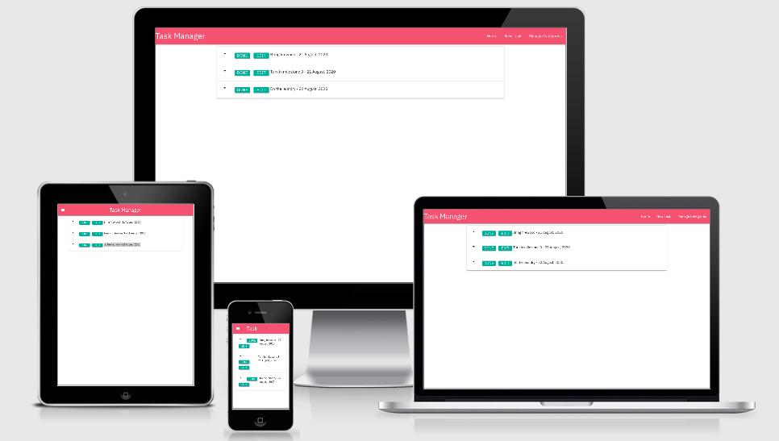

# Introduction
This is a task manager made primarily with Flask, using MongoDB as a database. The website was made to demonstrade simple CRUD operations. CRUD standing for create, read, update and delete. 
  
## UX
## User stories:  
Users can:
* Read tasks to be done
* Add tasks to be done
* Modify tasks
* When adding tasks, users can choose a date, time and if the task is a priority.
* Delete tasks 
* Users can add, modify and delete categories
  
## Design  
The design is simple and is in large, along with code borrowed from a tutorial created by Code Institute. The website uses a design language called Materialize, created by Google to allow "user experience across all their products on any platform".

## Testing
* http://ami.responsivedesign.is/ was used to check responsiveness on different Apple products.
  
* With the help of friends and family the website has been tested on different computers and mobile phones, including iPhone 12, Sony Xperia Z3 Compact and Huawei P10.
  
* The website has been tested on Chrome, Edge and Firefox on Windows 10 and Chrome and Firefox on Ubuntu (version 20.04).
  
* Google developer tools have been used to simulate different screen sizes.
  
* Debug was used during development to highlight and correct errors.
  
* CRUD functions have been manually tested, and the database has been checked to see if it received the correct input.

### Code validation
app.py was checked with PEP8 (http://pep8online.com/)  
The check only returned errors of a superficial nature, no code errors.
  
CSS checked with https://jigsaw.w3.org/css-validator/
No errors.
  
HTML checked with https://validator.w3.org/
No errors related to code function.

  
## Deployment
The code is hosted and published on heroku (https://www.heroku.com), to do this I:
  
* Signed up for an account with Heroku, created a new app with the name of 'owtaskmanager', the name has to be unique.
  
* I linked my heroku account to my GitHub repository, this way I only had to push to one repo (GitHub being the primary) Heroku then copies, builds and then publishes the app automatically.
  
Repository: https://github.com/oyvindwagner/taskmanager
Deployed website: https://owtaskmanager.herokuapp.com/
  
### Deploying locally
To deploy locally, follow these steps:  
  
* On GitHub, navigate to the main page of the repository.
* Under the repository name, click Clone or download.
* In the Clone with HTTPs section, click to copy the clone URL for the repository.
* Open Git Bash.
* Change the current working directory to the location where you want the cloned directory to be made.
* Type git clone, and then paste the URL you copied in Step 2. (git clone https://github.com/YOUR-USERNAME/YOUR-REPOSITORY)
* Press Enter. Your local clone will be created.
* Write "pip3 install -r requirements.txt" to install dependencies.
* For further information on cloning repositories, see https://docs.github.com/en/github/creating-cloning-and-archiving-repositories/cloning-a-repository.
  
 After this you need to add some environmental variables to create a local connection to the mongoDB database. Follow these steps:
   
 * Create a file named env.py in the root directory of your project. This is the file you will use to define your environment variables.
 * At the top of your env.py  file, you need to import os so that you can set the environment variables in the operating system. Once you have added the line “import os” underneath you can assign your environment variables using the following syntax: 
 * os.environ["Variable Name Here"] = "Value of Variable Goes Here" 
 * Example: os.environ["SECRET_KEY"] = "ohsosecret" 
 * Specific variables are described under "Database connection" in this readme.
 * The app should now run, using the command python3 app.py
  
## Databases
  
* The mongoDB database was created at mongoDB Atlas (https://www.mongodb.com/cloud/atlas), to achieve this I created an account there and made a cluster. Within this cluster I created a database called "task_manager". Inside the mentioned database I created 2 collections, they are "categories" and "tasks".
  
Within the "categories" collection I made 3 categories, they are:
  
* Home
* Work
* Cabin
  
Users will be able to choose from these 3 categories when adding a task to do.
  
Within the "task" collection, there are 5 objects, they are:
  
* category_name
* task_name
* task_description
* is_priority
* due_date
  
These represent where the user input will be saved.
  
### Database connection
  
To allow the app to communicate with the database, I went to settings in Heroku under a tab called "Config vars", here you can add "KEY" and "VALUE".  
To connect you need to enter 2 different keys, they are:  
* MONGO_DB
* MONGO_URI
  
The "MONGO_DB" key is the name of the database. "MONGO_URI" is the connection string, URI standing for "Uniform Resource Identifier". Using mongoDB Atlas, the URI can be found under Data Storage > Clusters > Overview, on the right there is a button called "Connect", opening this and selecting "Connect your application" will return the root string, it looks like this:  
  
* "mongodb+srv://root:<password>@cluster0.lnran.mongodb.net/<dbname>?retryWrites=true&w=majority"
  
You will have to add your password and database name in the string, under <password> and <dbname>.
  
## Notes
The console returns one error, related to a calendar hotfix due to using an older version of Materialize that needs Jquery as a dependency. 
